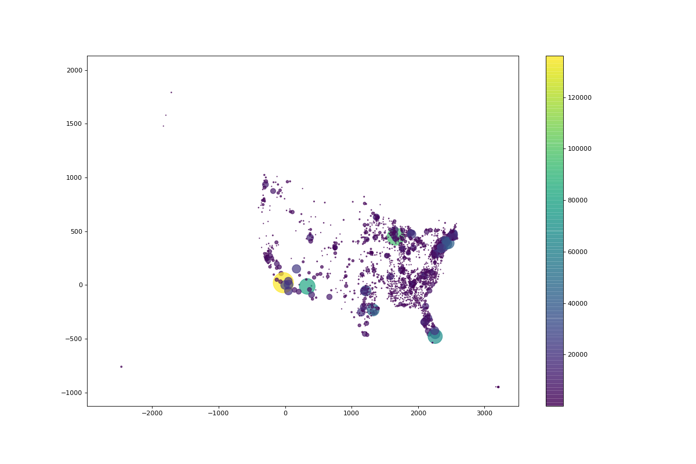

# jacob_gomez_project_datascience-repo

This exercise is to help us determine your ability to write quality, self-documenting code, pay attention to edge cases, and follow requiremetns. Your recruiter will let you know the deadline to submit your project from when we provide you access to this repository. It also checks your ability to use Git...

INSTRUCTIONS
1. Clone this (mostly) empty repository
2. Create a branch with the pattern AUS_FirstName_LastName
3. Write your project, be sure to include unit tests! Please include any databse sql files (including DDLs for any tables/views/functions/etc that you necessary to run your code)
4. Be sure to squash commits if you have more than 1 commit to your local branch.
5. When finished create a pull request against the develop branch, do not merge. Send your recruiter the link to your PR. Your recruiter must receive the link no more than 24 hours after you have been given access to the repo.

REQUIREMENTS

PART 1

The aim is to build a simple python application that will be able to show how many active cases of Covid 
or Covid-related deaths are currently reported within any given radius from any given US county.

As data source, use the following datasets:
- live COVID-19 cases by US County: https://github.com/nytimes/covid-19-data/blob/master/live/us-counties.csv.
- US Counties with geo coordinates: https://public.opendatasoft.com/explore/dataset/us-county-boundaries/table/?disjunctive.statefp&disjunctive.countyfp&disjunctive.name&disjunctive.namelsad&disjunctive.stusab&disjunctive.state_name

The application should use the following inputs: 
1. distinct US county (string) 
2. radius in miles (integer)
3. statistic ("confirmed_cases" or "confirmed_deaths")

The result can be either a command-line script or a juypiter notebook.

PART 2

Using the results of the first exercise, build an application that will visualize the results for every county on a map of the US. The style of visualization is up to you.

This is not a UI project, so the UI features don't have to be fancy. What matters is the clarity and robustness of the code, and the clarity of the data presentation (e.g. any hotspots must be clearly visible).

It would be preferred if the code used the live data instead of static spreadsheets. Please make sure to include a readme file which describes what packages are required to run your code.

Example:

